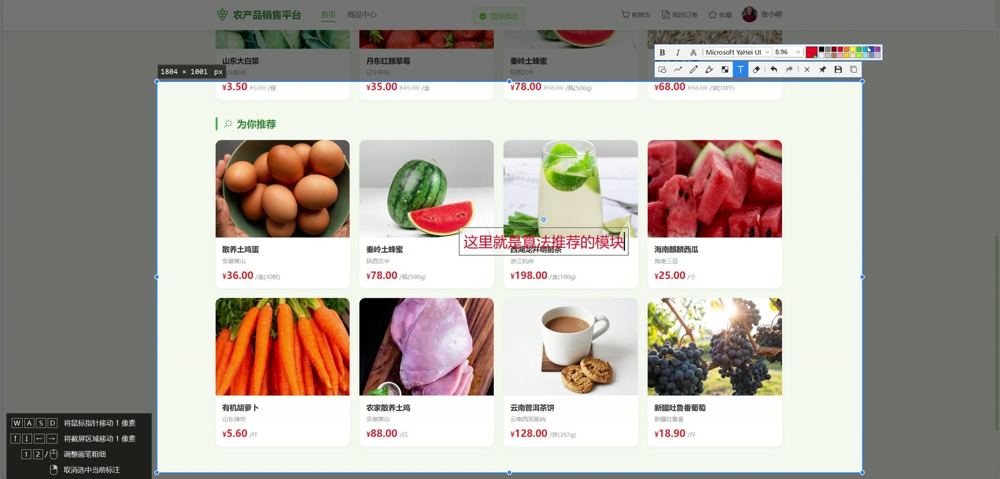
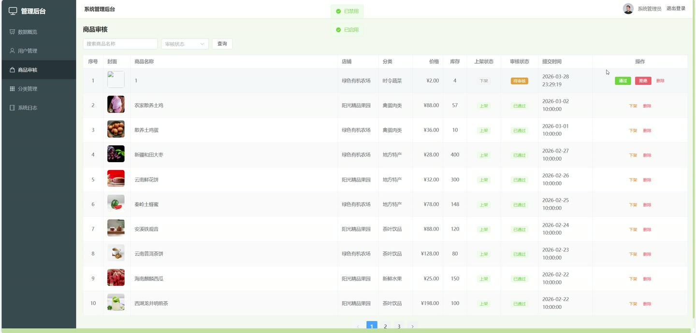
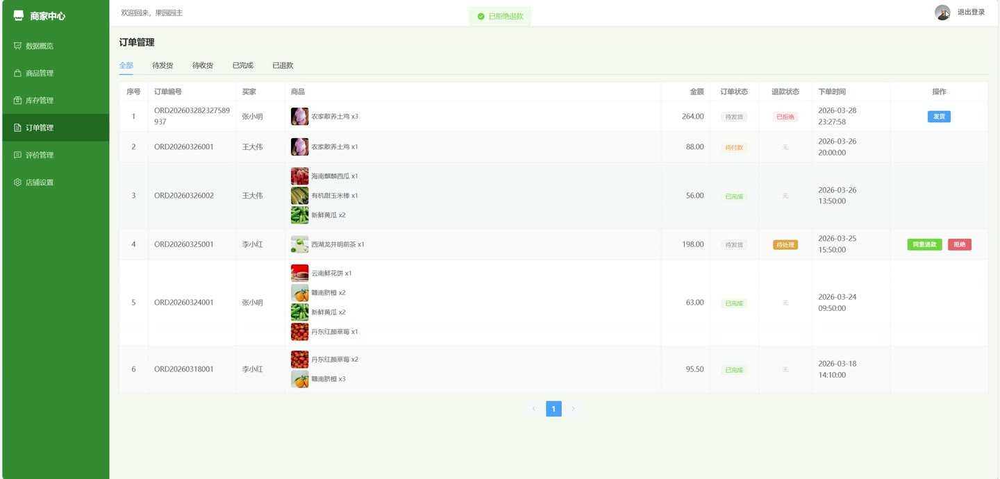
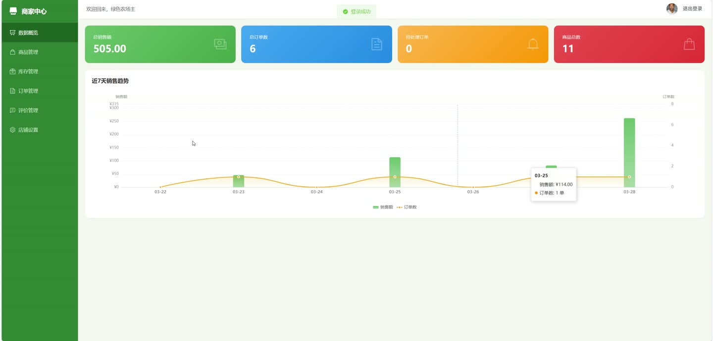

# (附文档)Springboot3+Vue3+MySQL 农产品销售平台

**技术栈**：Springboot3、Vue3、MySQL

### 系统简介

本系统是一个基于 Spring Boot 3 + Vue 3 + MySQL 的农产品销售平台，采用前后端分离架构。平台包含普通用户、商家、管理员三种角色，提供商品浏览、购物车、订单管理、店铺管理、商品审核、智能推荐、数据统计等完整功能。
 
### 核心功能
 
### 普通用户端

 
- 用户注册与登录：通过用户名和密码完成注册登录，登录后返回 JWT Token 
- 查看个人信息：获取当前登录用户的昵称、手机号、头像等基本信息 
- 修改个人信息：更新昵称、手机号、头像等个人资料 
- 修改密码：输入旧密码和新密码完成密码修改 
- 商品浏览：分页查看商品列表，支持按分类筛选、关键词搜索、按销量/价格排序 
- 商品详情：查看商品名称、价格、库存、描述、产地、多张图片、店铺名称、分类名称 
- 商品收藏：收藏感兴趣的商品，在收藏列表查看已收藏商品 
- 商品评价：购买后对商品进行评分（1-5星）并撰写评价内容，可上传多张评价图片 
- 收货地址管理：添加、编辑、删除收货地址，可设置默认地址 
- 购物车管理：将商品加入购物车、修改数量、删除购物车项、清空购物车 
- 创建订单：从购物车选择商品，选择收货地址，填写备注，按店铺分组生成订单 
- 支付订单：对待付款订单进行模拟支付操作 
- 取消订单：取消待付款订单，系统自动恢复商品库存 
- 确认收货：对已发货订单确认收货，订单状态变为已完成 
- 申请退款：对已付款订单填写退款原因提交退款申请 
- 查看订单列表：按订单状态筛选查看自己的订单，支持查看订单详情 
- 热销商品推荐：查看全平台或指定分类下的销量排行商品 
- 个性化推荐：基于用户购买记录和评价行为，系统自动推荐相关商品
 
### 商家端

 
- 店铺管理：查看和编辑店铺名称、店铺头像、店铺公告、店铺状态 
- 商品管理：查看店铺商品列表，支持按关键词和上下架状态筛选 
- 添加商品：填写商品名称、价格、库存、分类、描述、产地、封面图、多张详情图，提交后进入待审核状态 
- 编辑商品：修改商品信息，可重新上传图片 
- 商品上下架：手动上架或下架商品（需审核通过后才能上架） 
- 更新库存：直接修改商品库存数量 
- 删除商品：删除店铺内的商品，同时删除关联的商品图片 
- 订单管理：查看店铺订单列表，按订单状态筛选 
- 订单发货：对待发货订单执行发货操作 
- 退款处理：查看退款申请，同意退款或拒绝退款（拒绝时必须填写拒绝理由） 
- 评价管理：查看店铺收到的所有评价列表 
- 回复评价：对用户的评价进行商家回复 
- 数据统计：查看店铺的总订单数、待处理订单数、已完成订单数、总销售额、近7天销售趋势、商品总数
 
### 管理员端

 
- 商品审核：查看待审核商品列表，支持按审核状态和关键词筛选 
- 审核商品：对商品进行审核通过或拒绝操作，拒绝时可填写审核备注 
- 商品上下架管理：管理员可强制上架或下架任意商品 
- 删除商品：管理员可强制删除任意商品 
- 用户管理：查看用户列表，支持按关键词和角色筛选 
- 用户状态管理：启用或禁用用户账号 
- 商品分类管理：查看所有分类列表，添加、编辑、删除商品分类 
- 系统日志：查看所有操作日志列表，支持按关键词搜索 
- 全平台数据统计：查看总订单数、待处理订单数、已完成订单数、总销售额、近7天销售趋势、总用户数、总商品数
 
### 技术栈

 后端框架Spring Boot 3.x ORMMyBatis-Plus 权限认证JWT Token 前端框架Vue 3 状态管理Pinia 构建工具Vite 数据库MySQL
 
### 交付内容

 
- 后端完整源码 
- 前端完整源码 
- 数据库初始化脚本 
- 万字文档

## 界面展示

---

## 获取完整源码 + 万字文档

本仓库为项目介绍页。**完整前后端源码、数据库初始化脚本、万字项目文档**，请加微信 `kangkangcode`，或访问 [codekk.top](http://codekk.top) 获取。

可作课程设计 / 毕业设计参考，支持远程部署调试。